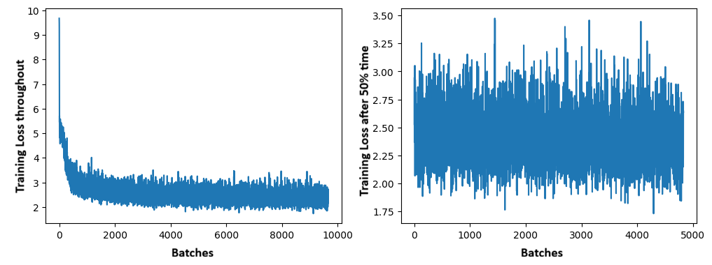
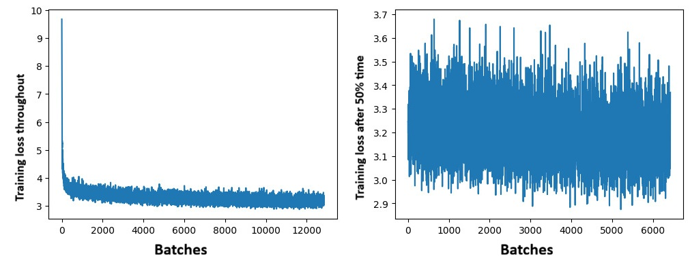
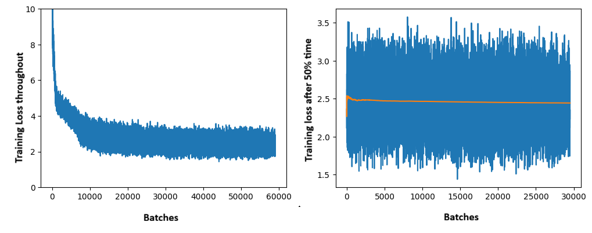
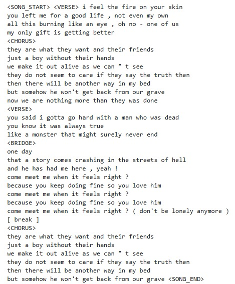
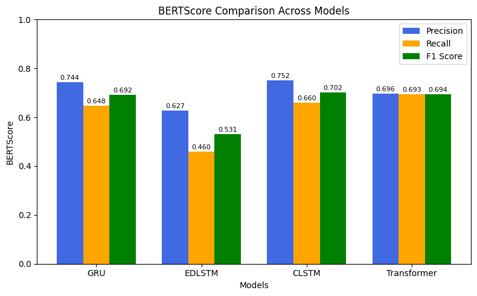
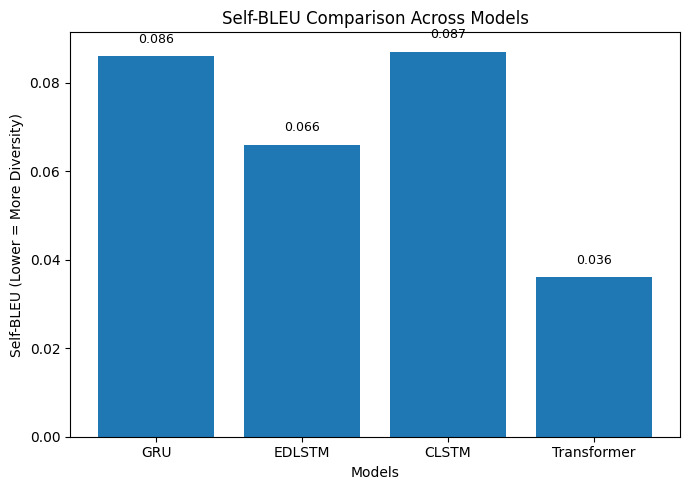
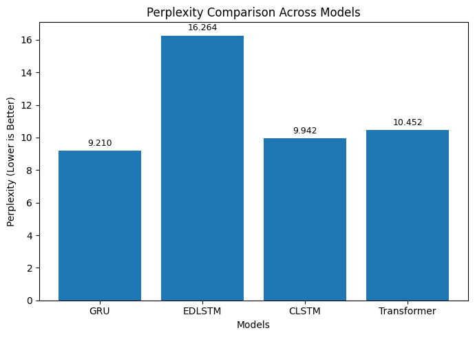
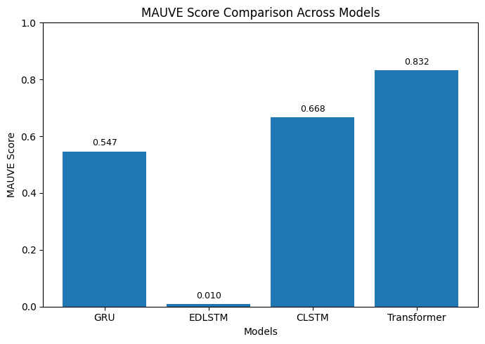

# Comparative Study of LSTM, GRU, EDLSTM and Transformer Architectures for Lyrics Generation Task with Enhanced Text Representations

**Team Members**

Shreya Gupta (MT2025724)  
Anirudh Sharma (MT2025732)  
Saatvik Sinha (MT2025722)  
Varshith Gowda (BT2024227)

# Project Structure Overview

## Notebooks

The notebooks directory contains end-to-end experiments and training pipelines for the corresponding deep learning architectures.

* `GRU_with_PrependConditioning.ipynb`
  Notebook for training and evaluating the GRU-based lyric generation model using prepend conditioning.

* `LSTM_with_MeanConditioning.ipynb`
  Notebook for training the LSTM-based model that uses mean conditioning for contextual guidance.
  All common utilities like theme extractor using TF-IDF, Sentence Piece Tokenizer, and Word Embeddings were trained once here, cached, and used in every other model.

* `LSTM_with_SequentialConditioning.ipynb`
  Notebook for training the sequential conditioning variant of the LSTM architecture.

* `Transformer.ipynb`
  Notebook containing the training workflow and experiments for the Transformer-based model.

---

## `src/`

### `dl_trainer/`

* `dl_trainer`
  Git submodule containing a reusable and generic `Trainer` class that implements the PyTorch training loop, including model training, validation, and checkpoint handling utilities.

---

## `src/generator_core/`

Core utilities and abstractions used throughout the project.

* `dataset_manager.py`
  Handles loading and preprocessing of the Genius Lyrics dataset.

* `other_utilities.py`
  Collection of miscellaneous helper functions and utility methods used across the codebase.

* `solution_manager.py`
  Defines abstract base classes and interfaces used by different model implementations.

---

## `src/models/`

Contains implementations of all model architectures along with their associated dataloaders.

* `GRU_with_PrependConditioning.py`
  Implements the GRU-based lyric generation model with prepend conditioning, along with its dataloader.
  **Author:** Saatvik Sinha

* `LSTM_with_MeanConditioning.py`
  Implements an LSTM-based model that performs theme word and genre conditioning using an auxiliary LSTM module, along with its dataloader.
  **Author:** Varshith Gowda

* `LSTM_with_SequentialConditioning.py`
  Implements an LSTM-based lyric generation model using sequential conditioning, along with its dataloader.
  **Author:** Anirudh Sharma

* `Transformer.py`
  Contains the Transformer-based model architecture and its associated dataloader implementation.
  **Author:** Shreya Gupta

* `Word2Vec_SkipGram.py`
  Simple implementation of the Skip-Gram Word2Vec model used for learning word embeddings.

## Introduction

Song lyrics present a unique challenge in natural language generation as
they inherently differ from ordinary text. They require a deep
understanding of structured repetition, sectional organization (such as
alternating verses and choruses), and the maintenance of long-range
thematic continuity.

In this work, we propose a lyrics generation system trained entirely
from scratch, exploring improved text representations to better capture
lyrical semantics and structure. To evaluate the efficacy of our
approach, these representations are used as input to LSTM, GRU, EDLSTM
and Transformer (decoder-only) language models. This allows for a
controlled comparison of how different architectures model long-range
dependencies in lyrical text.

## System Architecture and Datasets

The project is built upon a 4-Level Architecture:

1.  **Level 1 - Dataset Loading:** Raw data is processed via metadata
    extraction to create an annotated dataset.

2.  **Level 2 - Dataset Preparation:** Includes cleaning, normalization,
    tokenization, fortification, and embedding generation.

3.  **Level 3 - Training and Lyrics Generation:** Focuses on language
    model training and conditioned lyrics generation.

4.  **Level 4 - Model Evaluation:** Involves architecture comparison and
    evaluation.

### Dataset Statistics

To ensure rich vocabulary, structural learning, and linguistic
diversity, we focused our training on the Genius Song Lyrics dataset:

<table>
<thead>
<tr>
<th style="text-align: left;"><strong>Dataset</strong></th>
<th style="text-align: left;"><strong>Size</strong></th>
<th style="text-align: left;"><strong>Components</strong></th>
<th style="text-align: left;"><strong>Reason</strong></th>
</tr>
</thead>
<tbody>
<tr>
<td style="text-align: left;"><strong>Genius Song Lyrics</strong></td>
<td style="text-align: left;">9 GB</td>
<td style="text-align: left;">5 Mn songs from various artists across
several genres</td>
<td style="text-align: left;">Large-scale corpus providing rich
vocabulary, stylistic diversity, and genre coverage.</td>
</tr>
</tbody>
</table>

## Data Preprocessing and Pipeline Implementation

### Cleaning, Normalization, and Annotation Extraction

To prepare the raw Genius lyrics for training, a rigorous cleaning and
standardization pipeline was applied:

- **Noise Reduction & Normalization:** Non-lyrical artifacts such as
  HTML tags, URLs, contributor timestamps, and erratic ASCII characters
  were programmatically removed. The corpus was uniformly lowercased,
  and linguistic normalization was applied to expand common contractions
  and standardize punctuation marks.

- **Annotation Extraction:** Annotations serve as special control tokens
  defining the context and quality of the lyrics. While the base genre
  is provided natively within the dataset, thematic words were extracted
  programmatically using `scikit-learn`’s `TfidfVectorizer` (ignoring
  English stop-words, applying a document frequency limit). By applying
  the Term Frequency-Inverse Document Frequency (TF-IDF) algorithm, we
  statistically identified the top defining thematic keywords for each
  song.

### Tokenization and Structural Fortification

- **Subword Tokenization:** Rather than relying on basic word-level or
  character-level splits, we utilized Google’s `SentencePiece` library
  to train a custom subword tokenizer directly on the lyrical corpus.
  This resulted in a highly optimized custom unigram vocabulary of
  16,000 tokens (`lyrics_sp.model`), which efficiently handles
  out-of-vocabulary words, stylizations, and slang common in musical
  text.

- **Structural Injection (Fortification):** To preserve the unique
  macro-structure of songs, extracted structural hints were
  re-integrated into the token streams. Specific control tokens such as
  `<SONG_START>`, `<BRIDGE>`,`<INTRO>`,`<INTERLUDE>`,`<CHORUS>`,
  `<HOOK>`, `<OUTRO>`, and `<SONG_END>` were injected to explicitly
  teach the sequence models about structural transitions and boundaries.

### Custom Embeddings, Data Streaming, and Caching

- **Custom Lyrical Embeddings:** Standard generic embeddings map
  language context generally, which is suboptimal for poetic and highly
  repetitive text. Therefore, we trained a custom `Word2Vec_SkipGram`
  embedding model entirely from scratch. This custom layer maps our
  16,000-token vocabulary into a dense 512-dimensional vector space,
  utilizing distributional mapping to group musically co-occurring
  concepts closely together. Because this foundational embedding space
  is shared, it contributes exactly 8,192,000 embedder parameters
  equally across all implemented models.

- **Pipeline Caching:** To ensure maximum computational efficiency
  alongside streaming, the entire preprocessing pipeline utilizes an
  aggressive caching mechanism. Intermediate outputs for the dataset
  extraction, TF-IDF representations, vocabulary generation, and
  embedder preparation are serialized to disk (via `.cached` files).
  This circumvents redundant memory overhead across multiple language
  model training runs and significantly accelerates experimentation.

## Methodology and Model Architecture

### Sequence Packing and Batch Collation

To maximize the utility of the training data, varying sub-samples were
extracted from single songs using sliding and growing window techniques.
Because efficient GPU training requires perfectly rectangular input
tensors, sequences of varying lengths were padded using a zero-value
`<PAD>` token.

To handle this efficiently within the recurrent architectures, we
utilized PyTorch’s `pad_sequence`, `pack_padded_sequence`, and
`pad_packed_sequence` utilities. This ensures that the network
dynamically ignores the padded elements during both the forward pass and
loss calculation, optimizing computational throughput and preventing
gradient distortion.

### Architecture Design Space and Sequence Mapping

We established a comprehensive comparative baseline by exploring
different recurrent cell types (LSTM, GRU, EDLSTM) alongside a
decoder-only Transformer across various sequence mapping paradigms. To
ensure a standardized comparison, **all four architectures operate on
the same 512-dimensional custom word embedding space**. Our implemented
sequence modeling design space includes:

- **LSTM:** An architecture designed around the mean-encoding
  conditioning of annotations. It consists of a 2-layer LSTM with 384
  hidden units and utilizes an extra 64-dimensional embedding to
  represent genre. This allows the model to capture context words and
  genre information, supplying them dynamically to initialize the hidden
  and cell state variables.

- **GRU:** A standard Unidirectional Gated Recurrent Unit (GRU). The GRU
  serves as a computationally lighter alternative, allowing us to test
  if a simplified, two-gate mechanism can adequately capture lyrical
  dependencies without the memory overhead of an explicit cell state.

- **EDLSTM:** An encoder-decoder architecture utilizing a 2-layer LSTM
  encoder and a 2-layer LSTM decoder. Both recurrent blocks feature 512
  hidden units to deeply map contextual meaning before generating robust
  sequence outputs.

- **Transformer:** A decoder-only Transformer architecture was
  implemented to evaluate attention-based sequence modeling against the
  recurrent baselines. This model utilizes 4 transformer layers. To
  optimize memory bandwidth and computational efficiency during
  autoregressive generation, we utilized **Grouped Query Attention
  (GQA)** featuring 4 attention heads divided into 2 query groups.
  Additionally, the architecture incorporates **sinusoidal positional
  encodings** to effectively inject sequential context, alongside
  **Layer Normalization**.

**Regularization (Multiple Dropouts):** To aggressively combat
overfitting on the highly repetitive lyrical datasets, we implemented a
**Dropout rate of 0.1** at multiple strategic points across the
architectures. Each implementation serves a distinct purpose: embedding
dropout prevents over-reliance on specific vocabulary tokens,
attention/recurrent dropout stops the model from hyper-focusing on
isolated structural hints, and residual/hidden-layer dropout regularizes
the deep sequence representations.

### Annotation Conditioning

To guide the generative output toward specific lyrical styles or
thematic genres, we injected sampling control via Annotation
Conditioning. The primary techniques implemented include:

- **Prefix Conditioning:** Thematic keywords and genre tokens are
  explicitly prepended to the input sequence, acting as a stylistic
  prompt for the model.

- **Hidden State Initialization:** Utilized in our LSTM, the model
  extracts custom embeddings of the song’s thematic context words and
  concatenates them with the specific genre embedding. This condition
  vector is routed through a Fully Connected (FC) projection layer to
  explicitly initialize the initial hidden state (*H*0) and
  cell state (*C*0):
  *C**o**n**d**i**t**i**o**n* = \[*G**e**n**r**e*\_*V**e**c**t**o**r* ⊕ *C**o**n**t**e**x**t*\_*V**e**c**t**o**r*\]
  *H*0 = tanh (*W**h* ⋅ *C**o**n**d**i**t**i**o**n* + *b**h*)

- **Self Attention:** Utilized within the Transformer, allowing the
  model to dynamically weigh the importance of specific annotation
  tokens during generation.

### Sampling Strategies

To govern text generation and balance creative diversity with structural
coherence, we implemented a dynamic probability distribution sampling
engine. The output logits are scaled by a **Temperature** parameter;
higher temperatures increase randomness, while a temperature approaching
zero dynamically triggers a fallback to **Greedy Sampling** (argmax) to
prevent softmax overflow. For standard generation, the scaled logits are
filtered using **Top-K** and **Top-P (Nucleus) Sampling**, masking out
unlikely next tokens before sampling from the resulting multinomial
distribution.

Furthermore, an explicit **Repetition Penalty** was implemented during
the decoding loop. This mechanism dynamically penalizes the logit scores
of tokens that have already been generated in the current context,
heavily discouraging the architectures from falling into infinite,
generic text loops.

## Evaluation Mechanism

### Train-Time Evaluation

During the training phase, performance is monitored using the
**Categorical Cross Entropy Loss** and a specialized **Training BLEU
Score**. To actively track generative progression without interrupting
the training momentum, the BLEU score is computed periodically (e.g.,
every 50 batches) using a highly optimized pipeline.

**Calculation Mechanism:** The metric evaluates a single batch of
training data. It performs a single forward pass utilizing
teacher-forced inputs and applies greedy decoding (`argmax`) to predict
the highest probability tokens. To maximize efficiency, a 4-gram BLEU
score (utilizing a smoothing method to prevent zero-scores from sparse
matches) is computed directly on the raw numerical token IDs, entirely
skipping the detokenization step.

**Limitations and Trade-offs:** While functionally fast, this metric
acts strictly as a directional "pulse check" rather than a holistic
measure of generative quality. Its primary limitations include:

- **Sample Size Bias & Data Leakage:** Evaluating only a single training
  batch means the score is highly volatile and measures the model’s
  ability to memorize the training set rather than its generalization to
  unseen validation data.

- **Lack of Autoregressive Decoding:** By using teacher-forced logits,
  it only evaluates immediate next-token prediction rather than the
  model’s true ability to compose a coherent song iteratively from
  scratch.

- **Strict Token Matching:** Comparing raw numerical IDs ignores
  morphological variations (e.g., "run" vs. "running") that standard
  string matching might accommodate.

**The Trade-off (Extreme Speed):** Standard autoregressive decoding over
a large validation dataset is computationally expensive and highly
sequential. By restricting the sample size, keeping the data as
numerical IDs, and utilizing a single forward pass, we created a
diagnostic metric that evaluates in milliseconds. This ensures zero
bottlenecks and maintains the GPU’s training momentum.

### Post-Training Evaluation

In the post-training phase, we measured the quality of generated lyrics
by prompting the trained models with custom start strings of 3-4 words.
To streamline this process, an automated evaluation pipeline was
implemented to systematically generate candidate songs (controlling
parameters like genre, thematic keywords, maximum length, and
temperature) and export them directly to a standardized text file.

**Generation Hyperparameters:** To ensure a fair and consistent
comparative baseline across all architectures, the decoding parameters
were standardized for all reported results. Models generated a target
sequence length (`max_len`) of 400 to 500 tokens. The distribution was
softened with a `temperature` of 0.9, filtered via `top_k` = 50 and
`top_p` = 0.9, and guided by a `repetition_penalty` scalar of 1.2 to
preserve thematic continuity.  
The outputs were quantified using both reference-based and
reference-free metrics.

**Reference-Based Metrics** (requires human-written reference text):

- **BERTScore:** Measures semantic similarity between the generated and
  reference text (Higher = Better).

- **MAUVE:** Measures distribution similarity and divergence between the
  generated text and human text (Higher = Better).

**Reference-Free Metrics** (evaluated independently):

- **Perplexity (PPL):** Measures the model’s fluency and confidence in
  its own predictions (Lower = Better). It is calculated as:
  *P**P**L* = 2*H*(*p*)

- **Self-BLEU:** Measures the diversity of the generated text to
  penalize generic, repetitive outputs (Lower = Better). It is
  calculated as:
  $$Self\text{-}BLEU = \frac{1}{N}\sum\_{i=1}^{N}BLEU(s\_{i}, S - {s\_{i}})$$

- **LLM-as-a-judge:** A qualitative assessment utilizing a larger
  language model to score the exported evaluation samples strictly on
  Thematic Adherence, Genre consistency, and Lyrical Quality (Higher =
  Better).

## Results and Conclusion

### Quantitative Metrics

To rigorously assess the performance of our proposed architectures, we
tracked training convergence and computed final evaluation metrics for
each model.

#### CLSTM

Figure <a href="#fig:lstm_loss" data-reference-type="ref"
data-reference="fig:lstm_loss">1</a> illustrates the training
progression of the conditional LSTM architecture, demonstrating a smooth
and stable convergence to an average cross-entropy loss of 2.88. As
detailed in Table <a href="#tab:lstm_metrics" data-reference-type="ref"
data-reference="tab:lstm_metrics">[tab:lstm_metrics]</a>, the model
achieves a competitive perplexity of 9.711. Notably, the high MAUVE
score (0.683) and strong BERTScore F1 (0.708) indicate that the explicit
hidden-state initialization effectively guides the model to produce
lyrics with strong semantic alignment and distributional similarity to
actual human-written songs. Furthermore, the Self-BLEU remains
comfortably low at 0.097, validating the model’s creative diversity.

<figure id="fig:lstm_loss" data-latex-placement="h">

<figcaption>Training Loss curves for the LSTM architecture.</figcaption>
</figure>

<table>
<thead>
<tr>
<th style="text-align: left;"><strong>Metric</strong></th>
<th style="text-align: left;"><strong>Score</strong></th>
</tr>
</thead>
<tbody>
<tr>
<td style="text-align: left;">Parameter Counts</td>
<td style="text-align: left;">9165568</td>
</tr>
<tr>
<td style="text-align: left;">Average Cross Entropy Loss</td>
<td style="text-align: left;">2.88</td>
</tr>
<tr>
<td style="text-align: left;">Perplexity (PPL)</td>
<td style="text-align: left;">9.942</td>
</tr>
<tr>
<td style="text-align: left;">Self-BLEU</td>
<td style="text-align: left;">0.087</td>
</tr>
<tr>
<td style="text-align: left;">BERTScore (Precision / Recall / F1)</td>
<td style="text-align: left;">0.752 / 0.660 / 0.702</td>
</tr>
<tr>
<td style="text-align: left;">MAUVE</td>
<td style="text-align: left;">0.668</td>
</tr>
<tr>
<td style="text-align: left;">LLM as a Judge Score</td>
<td style="text-align: left;">0.59</td>
</tr>
</tbody>
</table>

#### GRU

Figure <a href="#fig:gru_loss" data-reference-type="ref"
data-reference="fig:gru_loss">2</a> illustrates the cross-entropy loss
during training, showcasing a steep initial convergence that stabilizes
at an average loss of approximately 3.17 in the later iterations. Table
<a href="#tab:gru_metrics" data-reference-type="ref"
data-reference="tab:gru_metrics">[tab:gru_metrics]</a> details the final
quantitative evaluation. The model achieved a highly respectable
perplexity of 9.21, indicating strong fluency. Furthermore, the low
Self-BLEU score (0.086) suggests that the model successfully avoids
repetitive, generic output loops, while the BERTScore and MAUVE metrics
confirm reasonable semantic overlap with human-written text.

<figure id="fig:gru_loss" data-latex-placement="h">

<figcaption>Training Loss curves for the GRU architecture.</figcaption>
</figure>

<table>
<thead>
<tr>
<th style="text-align: left;"><strong>Metric</strong></th>
<th style="text-align: left;"><strong>Score</strong></th>
</tr>
</thead>
<tbody>
<tr>
<td style="text-align: left;">Parameter Counts</td>
<td style="text-align: left;">3431552</td>
</tr>
<tr>
<td style="text-align: left;">Average Cross Entropy Loss</td>
<td style="text-align: left;">3.170</td>
</tr>
<tr>
<td style="text-align: left;">Training BLEU (Last 10 Batches)</td>
<td style="text-align: left;">0.388</td>
</tr>
<tr>
<td style="text-align: left;">Perplexity (PPL)</td>
<td style="text-align: left;">9.210</td>
</tr>
<tr>
<td style="text-align: left;">Self-BLEU</td>
<td style="text-align: left;">0.086</td>
</tr>
<tr>
<td style="text-align: left;">BERTScore (Precision / Recall / F1)</td>
<td style="text-align: left;">0.744 / 0.648 / 0.692</td>
</tr>
<tr>
<td style="text-align: left;">MAUVE</td>
<td style="text-align: left;">0.547</td>
</tr>
<tr>
<td style="text-align: left;">LLM as a Judge Score</td>
<td style="text-align: left;">0.38</td>
</tr>
</tbody>
</table>

#### EDLSTM

The training dynamics of the Encoder-Decoder LSTM (EDLSTM) are presented
in Figure <a href="#fig:edlstm_loss" data-reference-type="ref"
data-reference="fig:edlstm_loss">3</a>, which showcases the lowest
average cross-entropy training loss among the recurrent models at 2.30.
However, Table <a href="#tab:edlstm_metrics" data-reference-type="ref"
data-reference="tab:edlstm_metrics">[tab:edlstm_metrics]</a> reveals a
notable discrepancy between train-time loss and unguided generation
quality. The architecture yields a higher perplexity (16.264) and a
severely reduced MAUVE score (0.010). While the exceptionally low
Self-BLEU (0.066) proves the generated text is non-repetitive, the lower
BERTScore and MAUVE suggest that the strict contextual bottleneck of the
encoder-decoder mapping struggles to maintain the underlying semantic
distribution of human lyrics during extended autoregressive inference.

<figure id="fig:edlstm_loss" data-latex-placement="h">

<figcaption>Training Loss curves for the EDLSTM
architecture.</figcaption>
</figure>

<table>
<thead>
<tr>
<th style="text-align: left;"><strong>Metric</strong></th>
<th style="text-align: left;"><strong>Score</strong></th>
</tr>
</thead>
<tbody>
<tr>
<td style="text-align: left;">Parameter Counts</td>
<td style="text-align: left;">16612992</td>
</tr>
<tr>
<td style="text-align: left;">Average Cross Entropy Loss</td>
<td style="text-align: left;">2.30</td>
</tr>
<tr>
<td style="text-align: left;">Perplexity (PPL)</td>
<td style="text-align: left;">16.264</td>
</tr>
<tr>
<td style="text-align: left;">Self-BLEU</td>
<td style="text-align: left;">0.066</td>
</tr>
<tr>
<td style="text-align: left;">BERTScore (Precision / Recall / F1)</td>
<td style="text-align: left;">0.627 / 0.460 / 0.531</td>
</tr>
<tr>
<td style="text-align: left;">MAUVE</td>
<td style="text-align: left;">0.010</td>
</tr>
<tr>
<td style="text-align: left;">LLM as a Judge Score</td>
<td style="text-align: left;">0.44</td>
</tr>
</tbody>
</table>

#### Transformer

Figure <a href="#fig:transformer_loss" data-reference-type="ref"
data-reference="fig:transformer_loss">4</a> visualizes the training
convergence of the Decoder-only Transformer, which stabilizes at a
highly efficient average cross-entropy loss of 2.43. The quantitative
superiority of the self-attention mechanism becomes immediately apparent
in the generation metrics detailed in Table
<a href="#tab:transformer_metrics" data-reference-type="ref"
data-reference="tab:transformer_metrics">[tab:transformer_metrics]</a>.
The Transformer achieves an outstanding MAUVE score of 0.832, proving
its generated text distribution is remarkably close to actual human
lyrics. Coupled with the lowest Self-BLEU score across all implemented
models (0.036) and a solid perplexity of 10.452, the Transformer
demonstrates a superior ability to map long-range thematic vocabulary
and maintain high creative diversity without falling into repetitive
loops.

<figure id="fig:transformer_loss" data-latex-placement="h">

<figcaption>Training Loss curves for the Transformer
architecture.</figcaption>
</figure>

<figure id="fig:transformer_output" data-latex-placement="H">

<figcaption><strong>Sample Lyrics Generated by the Transformer
Model.</strong> </figcaption>
</figure>

<table>
<thead>
<tr>
<th style="text-align: left;"><strong>Metric</strong></th>
<th style="text-align: left;"><strong>Score</strong></th>
</tr>
</thead>
<tbody>
<tr>
<td style="text-align: left;">Parameter Counts</td>
<td style="text-align: left;">11575936</td>
</tr>
<tr>
<td style="text-align: left;">Average Cross Entropy Loss</td>
<td style="text-align: left;">2.43</td>
</tr>
<tr>
<td style="text-align: left;">Perplexity (PPL)</td>
<td style="text-align: left;">10.452</td>
</tr>
<tr>
<td style="text-align: left;">Self-BLEU</td>
<td style="text-align: left;">0.036</td>
</tr>
<tr>
<td style="text-align: left;">BERTScore (Precision / Recall / F1)</td>
<td style="text-align: left;">0.696 / 0.693 / 0.694</td>
</tr>
<tr>
<td style="text-align: left;">MAUVE</td>
<td style="text-align: left;">0.832</td>
</tr>
<tr>
<td style="text-align: left;">LLM as a Judge Score</td>
<td style="text-align: left;">0.6</td>
</tr>
</tbody>
</table>

### Comparative Evaluation Across Metrics

<figure id="fig:all_metrics" data-latex-placement="t">
<figure id="fig:bert_score">

<figcaption>BERTScore Comparison</figcaption>
</figure>
<figure id="fig:self_bleu">

<figcaption>Self-BLEU Comparison</figcaption>
</figure>
<figure id="fig:perplexity">

<figcaption>Perplexity Comparison</figcaption>
</figure>
<figure id="fig:mauve">

<figcaption>MAUVE Score Comparison</figcaption>
</figure>
<figcaption><strong>Comparative Evaluation of Models across
Metrics.</strong> Transformer achieves the best balance across semantic
similarity (BERTScore), diversity (Self-BLEU), fluency (Perplexity), and
distributional alignment (MAUVE).</figcaption>
</figure>

As shown in Figure <a href="#fig:all_metrics" data-reference-type="ref"
data-reference="fig:all_metrics">10</a>, the Transformer model achieves
the most balanced performance across all evaluation metrics. It
demonstrates superior distributional alignment (highest MAUVE), strong
semantic similarity (BERTScore), and the highest diversity (lowest
Self-BLEU), while maintaining competitive perplexity compared to
recurrent architectures.

## Conclusion

This comparative study comprehensively evaluated the efficacy of various
neural network architectures - specifically LSTM, GRU, EDLSTM, and a
Decoder-only Transformer - in the highly structured domain of lyrics
generation. A foundational takeaway from this research is that standard
text generation approaches are suboptimal for musical text. Instead, the
implementation of a custom 512-dimensional lyrical embedding space,
combined with rigorous structural fortification and hidden-state
annotation conditioning, proved strictly necessary to maintain thematic
consistency and macro-level coherence.

Our quantitative and qualitative evaluations revealed distinct
architectural trade-offs. The simpler recurrent networks, particularly
the baseline GRU, demonstrated rapid convergence and computational
efficiency but frequently suffered from repetitive looping artifacts
during extended generation. The advanced recurrent models (LSTM and
EDLSTM) mitigated these loops through more robust memory gating and
explicit conditioning. However, the EDLSTM’s strict contextual
bottleneck struggled to align with the semantic distribution of
human-written text during unguided, long-form autoregressive inference,
resulting in a drastically lower MAUVE score.

Ultimately, the Decoder-only Transformer emerged as the most capable
architecture for capturing the long-range dependencies inherent to
songwriting. By leveraging Grouped Query Attention, it achieved the
highest distributional similarity to actual human lyrics and the
greatest creative diversity (lowest Self-BLEU), successfully avoiding
the repetitive traps that limited the recurrent baselines.

However, while the advanced architectures successfully navigated
thematic and structural continuity, all models exhibited limitations in
adhering to strict phonetic rhyming schemes over extended token lengths.
Future work in this domain should explore integrating phonetic
tokenization or reinforcement learning penalties specifically targeted
at meter and rhyme to fully bridge the gap between algorithmic text
generation and authentic musical artistry.

### Observed Limitations and Failure Modes

Despite the robust performance of the advanced architectures, several
generation artifacts were observed. The simpler Recurrent networks
(particularly the GRU) suffered from maintaining thematic adherence and
genre consistency. While the LSTM, EDLSTM, and Transformer mitigated
this repetition and maintained long-range continuity, they occasionally
struggled with strict rhyming schemes over extended token lengths
without explicit phonetic conditioning.

## Code Availability

The complete source code, dataset preprocessing scripts, streaming
implementations, and evaluation pipelines for this comparative study can
be found in this GitHub repository.
